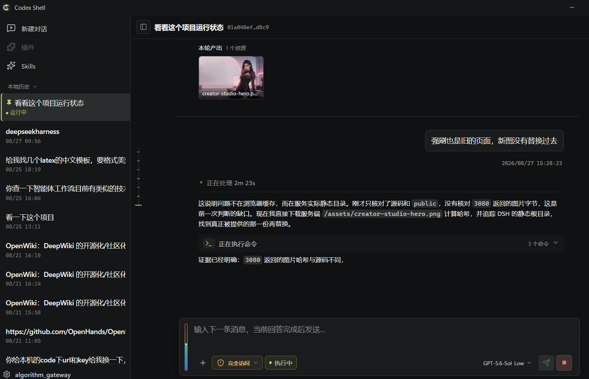

# Codex Shell

Codex Shell（简称 **CS**）是一个面向个人开发者的 Windows 智能体工作台：把 Codex 的执行能力装进一个更适合长期使用、可自由配置、方便二次开发的桌面壳子里。

它的核心不是重新实现一个 Agent，而是**复用原版 `codex app-server` 作为唯一执行内核**，由 CS 负责桌面交互、Session 管理、文件与 Diff 展示、模型设置和工作流体验。这样既能跟随 Codex 的 Thread、工具、审批、Plan、Goal、Review 等原生能力，又能让个人产品拥有自己的界面和扩展空间。

## 为什么值得使用

- **一个窗口完成开发型对话**：文本、图片和文件附件，项目工作区，`@文件` 引用，命令执行过程、计划、工具活动和最终回答都在同一条时间线里呈现。
- **多 Session 真正可管理**：历史会话、置顶、归档、删除、重命名、分叉和路径复制；多个 Session 可以并行执行，互不抢占对方的对话状态。
- **模型由你决定**：直接填写模型 ID；使用 OpenAI 兼容网关或自定义 Base URL；在对话过程中切换模型、推理强度、回答冗余度和高级 Provider 参数，不会因为换参数而新开 Session。
- **执行过程可控**：支持只读、工作区写入和完全访问等原生权限范围；任务运行时可以排队发送，也可以使用 Steer 引导当前任务；审批请求和工具状态集中展示。
- **代码变更可审查**：会话时间线展示实时 Diff、文件状态和增删统计；右侧项目文件浏览器可打开工作区文件进行查看。
- **长时间使用更稳定**：时间线使用单一原生滚动容器；用户阅读历史时不会被流式输出或布局更新强行拉回底部；“返回最新”是明确的单次定位动作。
- **与官方 Codex 隔离**：配置、Session、SQLite、日志、缓存、Skills 和默认项目目录独立保存，不污染官方 Codex。

## 产品界面

CS 将模型回答、执行过程、文件变更和本轮产出整合到同一条时间线中；左侧管理多 Session，底部 Composer 支持模型、权限、队列/引导和附件操作，右侧按需打开项目文件与侧边工具。



> 产品界面示例：执行过程可折叠，生成的图片支持在会话中预览；实际布局会随窗口尺寸、主题和运行状态自适应。

## 核心工作方式

```text
CS 桌面壳（Tauri + React）
        │  stdio JSON-RPC
        ▼
原版 codex app-server
        │
        ▼
你选择的模型网关 / 模型服务
```

CS 不修改 Codex Core，也不在前端复制一套 Agent 执行循环。所有智能体执行、工具调用、审批、Session 持久化和协议事件仍由 `codex app-server` 负责，CS 只做可靠的桌面呈现和交互编排。

## 快速开始

### 下载 Windows 安装包

当前公开稳定版仍为 [Codex Shell v0.1.3](https://github.com/xxxxxxxxxxxxxxxxxxx20gex/codex-shell/releases/tag/v0.1.3)：下载
`codex-shell_0.1.3_x64-setup.exe` 后按向导安装。下一版将加入 Tauri Updater，当前公开 Release 未进行 Windows Authenticode 代码签名，
Windows SmartScreen 可能在首次运行时显示提示；这是个人二开项目，不代表 OpenAI
官方产品或背书。

安装后也可以打开“设置 → 运行环境 → 检查并更新”。CS 会检查官方 Release 的签名更新，
发现新版本后下载并启动安装器，安装完成后自动重启应用。更新过程不会把 API Key 或会话内容
发送给 CS 自己的服务器；更新包来自项目配置的 GitHub Release 端点。

### 运行已构建的桌面端

开发构建产物位于：

```text
src-tauri/target/debug/codex-shell.exe
```

双击即可启动。首次使用时，在 Composer 的模型选择处填写：

1. 模型 ID；
2. OpenAI 兼容的 Base URL（例如你的中转站地址）；
3. API Key；
4. 可选的推理强度、回答冗余度和高级 Provider 参数。

API Key 只保存到 Windows Credential Manager，不写入项目文件、Session、日志或普通配置 JSON。

### 隐私与数据传输

CS 不会在后台主动向外部服务上传会话内容。只有当用户发送消息，或主动触发
需要智能体执行的操作时，CS 才会通过原版 `codex app-server` 与用户自行选择和配置的模型服务
或网关通信。CS 不提供内置网关，也不会把请求转发到 CS 自己运营的公共模型服务。

一次用户发起的任务中，请求可能包含：

- 用户输入的文本；
- 用户主动选择或粘贴的图片、文件及其内容；
- 当前工作目录和完成任务所需的相关文件内容；
- 工具调用结果、命令输出以及其他必要的执行上下文。

排队发送、Steer 引导、自动重试、上下文压缩，以及用户主动触发的 Plan、Goal、Review
或工具操作，都属于原任务的后续处理，可能继续产生发往所选模型服务的请求。具体请求的保留、
日志和处理方式取决于用户配置的模型服务或网关及其隐私政策，CS 无法替代该服务提供方作出承诺。

API Key 仅保存到 Windows Credential Manager，不写入仓库、Session 文件、普通配置文件或应用日志。
CS 不会将与功能无关的遥测数据上传到外部服务。

### 代码签名

下一版 Windows 安装包将使用 Tauri Updater 的 minisign 更新签名校验。当前 `v0.1.3` 安装包
尚未包含 updater 能力；安装包本身也可能因未配置 Windows Authenticode 代码签名而触发
SmartScreen 提示。Tauri 更新签名与 Windows 代码签名是两套独立机制。签名私钥只保存在
GitHub Actions Secret 中，不提交到仓库。

### 创建第一条对话

1. 点击“新建对话”；
2. 可选一个项目目录，不选时 CS 会创建当天的默认项目目录；
3. 在输入框发送任务；
4. 通过会话时间线查看多轮历史和文件变更，右侧可打开项目文件浏览器；
5. 需要继续其他工作时，新建或切换 Session，当前执行不会被其他 Session 覆盖。

输入框支持：

- 拖拽或粘贴图片、文件；
- 使用 `@` 引用工作区文件；
- 使用 `/` 打开 Skills、MCP、压缩、Plan、Goal、Review 等能力入口；
- 任务运行中默认 Queue；使用 `Ctrl/Cmd+Shift+Enter` Steer 当前任务。

## 模型、权限与工作区

### 模型配置

CS 不强制绑定某一家模型服务，也不提供内置模型网关、公共 API 配额或代运营的中转服务。
用户需要自行准备并配置官方 API、OpenAI 兼容的自建网关或其他可信模型服务，并自行承担
该服务的费用、可用性和数据处理责任。模型 ID 手动填写，能力和可用参数优先读取 app-server
的模型目录；第三方模型的特殊参数放在高级 Provider 设置中，不会污染通用对话流程。

### 权限策略

Composer 中的权限选择对应 app-server 的原生沙盒边界：

- 只读：适合分析和审查；
- 工作区写入：允许修改当前项目；
- 完全访问：允许执行更广泛的本机操作。

权限和审批策略会随下一次 Turn 生效，不会因为调整参数而创建新 Session。

### 默认路径与隔离

Codex Shell 使用应用标识 `com.codexshell.desktop`，不会复用官方 Codex 的 `CODEX_HOME`：

- 应用配置：`%APPDATA%\com.codexshell.desktop`
- 本地数据：`%LOCALAPPDATA%\com.codexshell.desktop`
- 独立 CODEX_HOME：默认 `%USERPROFILE%\.codex-shell`
- 默认项目目录：`%USERPROFILE%\Documents\Codex-Shell\YYYY-MM-DD`

用户可以在设置中指定其他绝对路径，但必须与官方 `%USERPROFILE%\.codex` 保持隔离。项目目录选择只改变新 Thread 的 `cwd`，不会复制项目或改变 Session 数据归属。

## 这是一个什么样的二开项目

CS 适合以下方向：

- 做一个个人品牌化的 Codex 桌面产品；
- 接入自有模型网关、企业模型目录或本地模型；
- 在不改动 Codex Core 的前提下重新设计工作流和 UI；
- 加入团队需要的插件、Skills、MCP 管理、审查流程或知识库入口；
- 将 app-server 的原生事件包装成更适合特定行业的操作面板。

建议的二开边界是：**Core 负责智能体语义，CS 负责产品体验，Tauri/Rust 负责本机能力**。新增功能优先复用稳定的 app-server v2 接口；不要在前端另起一套执行循环，也不要把密钥、模型路由或用户数据写入源码。

## 基于 Wiki 理念的开发模式

CS 采用“代码实现 + 仓库文档 Wiki”协同的开发方式。文档不是一次性说明书，而是
随着项目演进持续维护的知识入口；每次跨模块改动都应同步更新对应的当前状态，避免
实现、设计和使用说明逐渐分叉。

- `AGENTS.md`：长期架构边界、开发规则、安全约束和文档治理；
- `README.md`：面向使用者的稳定功能、安装和使用说明；
- `DESIGN.md`：统一的 UI 视觉与交互契约；
- `docs/status/`：各模块当前行为、风险、验证证据和下一步；
- `docs/decisions/ADR-*.md`：重要架构取舍及其原因；
- Git 分支、提交和 tag：完整历史与版本发布依据。

这种模式借鉴 Wiki 的可持续维护理念，但不引入额外的 Wiki 服务：文档与代码在同一
个仓库中审查、提交和发布，当前事实以源码、验证结果和唯一职责文档为准。

## 从源码运行

### 分支与版本

- `main`：个人项目的日常开发与稳定主线；
- `release/vX.Y.Z`：对应已发布版本的冻结维护分支，并与同名 Git tag 对齐；当前公开版本为 `release/v0.1.3`。Updater 集成将在下一版本发布分支中生效。

日常改动直接提交到 `main`，通过质量门禁后正式发布。发布时从 `main` 创建版本分支
和 tag，安装包与该 tag 保持一致。

环境要求：Windows、Node.js、pnpm、Rust、Visual Studio C++ Build Tools，以及可用的 `codex.exe` Runtime。

```powershell
pnpm install

# 浏览器开发模式
pnpm dev

# Tauri 桌面开发模式
pnpm tauri dev
```

如果需要指定 Runtime，可以设置 `CODEX_SHELL_RUNTIME` 为 `codex.exe` 文件或其所在目录。相对路径按启动目录解析；未设置时，CS 会依次检查桌面端同目录的 sidecar 和系统 PATH，并验证为规范化绝对路径。

## 构建与质量验证

```powershell
pnpm typecheck
pnpm lint
pnpm test
pnpm test:quality
pnpm build
pnpm rust:check
pnpm desktop:build
```

生成可分发的 Windows 安装包：

```powershell
pnpm desktop:package
```

该命令会先发现并暂存通过协议兼容门禁的 Runtime，再执行正式 Tauri bundle。NSIS 安装包位于
`src-tauri/target/release/bundle/nsis/`。Runtime 的
LICENSE/NOTICE 会随安装包一同带上；正式公开发布前仍应完成代码签名、第三方依赖
许可清单和干净 Windows 环境验收。

准备/更新 Runtime 和协议类型：

```powershell
pnpm runtime:stage
pnpm protocol:generate
```

Runtime 不要求与上一次 manifest 的完整版本号相同。暂存时会从同一来源复制主 Runtime
和 companion binaries，记录实际版本与 SHA-256，并检查 CS 当前依赖的 app-server
请求、通知和反向请求仍存在。协议新增能力不会自动改变 UI；如果生成类型发生变化，
请显式运行 `pnpm protocol:generate`，审查生成差异并完成完整回归测试。

独立测试脚本统一放在 [tests/scripts](tests/scripts)；源码旁的 `*.test.*` 和 Rust 测试保持就地维护，方便复用模块夹具和类型。

## 项目文档

- [AGENTS.md](AGENTS.md)：架构边界、代码规范、安全规则和文档治理；
- [DESIGN.md](DESIGN.md)：UI 设计契约；
- [docs/README.md](docs/README.md)：状态文档、ADR 和文档地图；
- [docs/status/PROJECT_STATUS.md](docs/status/PROJECT_STATUS.md)：项目当前快照、风险和验证基线。

当前项目仍处于持续开发阶段。Runtime 获取、安装包签名、CI、断线恢复和插件内部逻辑还在后续里程碑中；如果你希望基于 Codex app-server 打造自己的桌面智能体，欢迎从 UI、模型网关、Skills/MCP 或行业工作流方向开始扩展。
